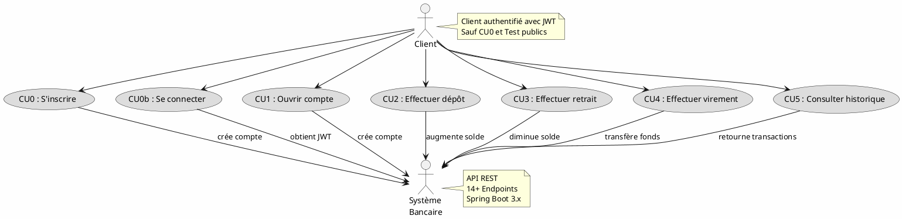
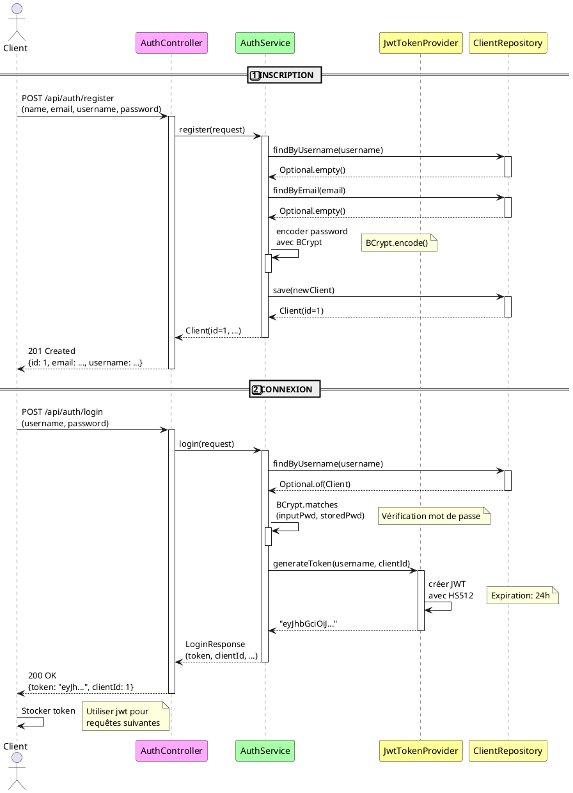
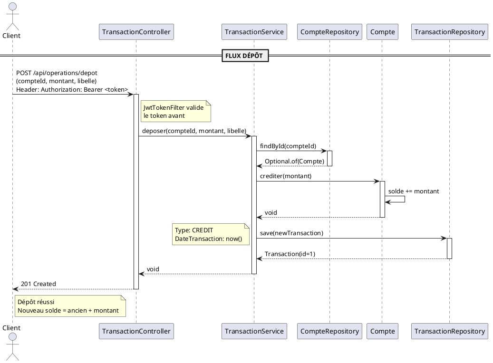
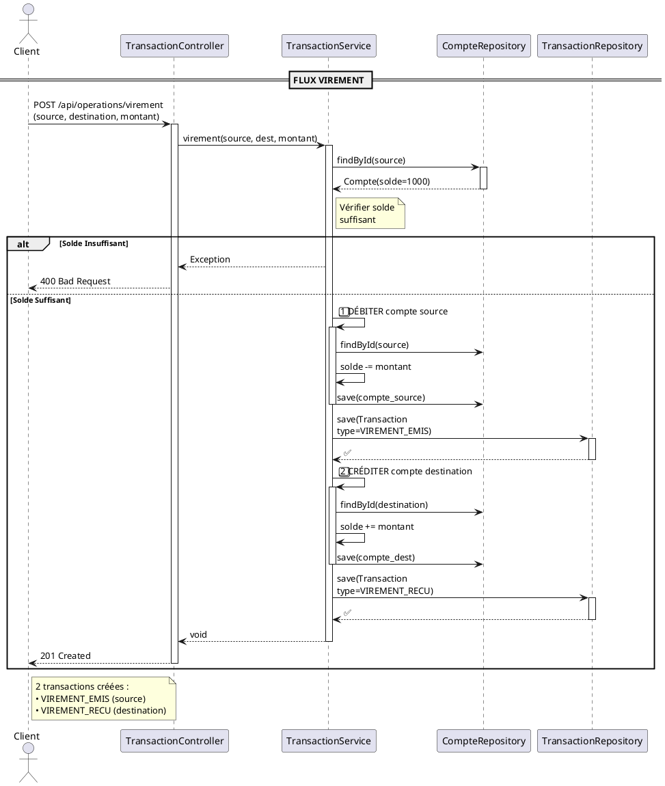
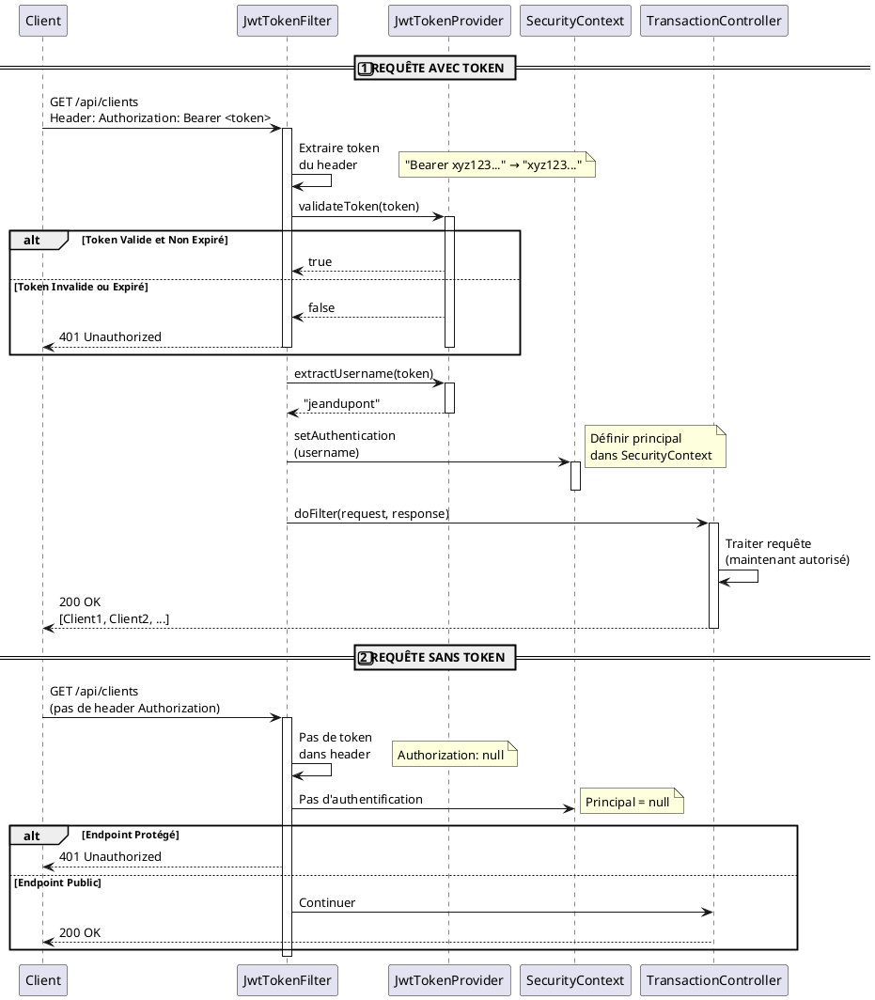

# 📐 DIAGRAMMES UML - Gestion Bancaire

## 1️⃣ DIAGRAMME DE CAS D'UTILISATION (Use Case Diagram)



---

## 2️⃣ DIAGRAMME DE CLASSES (Class Diagram)

```plantuml
@startuml ClassDiagram
!define TABLE_COLOR #AAFFAA
!define SERVICE_COLOR #AAFFFF
!define CONTROLLER_COLOR #FFAAFF
!define DTO_COLOR #FFFFAA

skinparam backgroundColor #FEFEFE
skinparam classBorderColor #111111
skinparam classBackgroundColor #DDD
skinparam arrowColor #111111

package "Entity" {
    class Client {
        - id: Long
        - name: String
        - prenom: String
        - email: String (unique)
        - username: String (unique)
        - password: String (hashé)
        - telephone: String
        - actif: Boolean
        - comptes: List<Compte>
    }

    class Compte {
        - id: Long
        - numeroCompte: String (IBAN)
        - solde: BigDecimal
        - dateOuverture: LocalDate
        - typeCompte: String
        - client: Client
        - transactions: List<Transaction>
        + crediter(montant)
        + debiter(montant)
    }

    class Transaction {
        - id: Long
        - montant: BigDecimal
        - dateTransaction: LocalDateTime
        - typeTransaction: String
        - description: String
        - compte: Compte
    }
}

package "DTO" {
    class RegisterRequest {
        - name: String
        - prenom: String
        - email: String
        - telephone: String
        - username: String
        - password: String
        - passwordConfirm: String
    }

    class LoginRequest {
        - username: String
        - password: String
    }

    class LoginResponse {
        - token: String
        - type: String
        - clientId: Long
        - username: String
        - email: String
    }

    class CompteRequest {
        - client_id: Long
        - typeCompte: String
        - soldeInitial: BigDecimal
    }

    class DepotRequest {
        - compteId: Long
        - montant: BigDecimal
        - libelle: String
    }

    class RetraitRequest {
        - compteId: Long
        - montant: BigDecimal
        - libelle: String
    }

    class VirementRequest {
        - source: Long
        - destination: Long
        - montant: BigDecimal
        - libelle: String
    }
}

package "Service" {
    class AuthService {
        - clientRepository: ClientRepository
        - jwtTokenProvider: JwtTokenProvider
        + register(request): Client
        + login(request): LoginResponse
    }

    class ClientService {
        - clientRepository: ClientRepository
        + creerClient(name, prenom, email, tel)
        + listerTousLesClients(): List<Client>
        + trouverParId(id): Client
        + supprimerClient(id)
        + findByUsername(username): Optional<Client>
    }

    class CompteService {
        - compteRepository: CompteRepository
        - clientRepository: ClientRepository
        + ouvrirCompte(clientId, type, solde): Compte
        + listerComptesDuClient(clientId): List<Compte>
        + consulterSolde(compteId): BigDecimal
    }

    class TransactionService {
        - transactionRepository: TransactionRepository
        - compteRepository: CompteRepository
        + deposer(compteId, montant, libelle)
        + retirer(compteId, montant, libelle)
        + virement(source, dest, montant, libelle)
        + historique(compteId): List<Transaction>
    }
}

package "Controller" {
    class AuthController {
        - authService: AuthService
        + register(request): Client
        + login(request): LoginResponse
        + test(): String
    }

    class ClientController {
        - clientService: ClientService
        + creer(client): Client
        + lister(): List<Client>
        + trouver(id): Client
        + supprimer(id): void
    }

    class CompteController {
        - compteService: CompteService
        + ouvrir(request): Compte
        + duClient(clientId): List<Compte>
        + solde(compteId): BigDecimal
    }

    class TransactionController {
        - transactionService: TransactionService
        + depot(request): void
        + retrait(request): void
        + virement(request): void
        + releve(compteId): List<Transaction>
    }
}

package "Security" {
    class JwtTokenProvider {
        - jwtSecret: String
        - jwtExpiration: Long
        + generateToken(username, clientId): String
        + validateToken(token): Boolean
        + extractUsername(token): String
        + extractUserId(token): Long
    }

    class CustomUserDetailsService {
        - clientRepository: ClientRepository
        + loadUserByUsername(username): UserDetails
    }
}

package "Repository" {
    interface ClientRepository {
        + findByUsername(username): Optional<Client>
        + existsByUsername(username): Boolean
        + existsByEmail(email): Boolean
    }

    interface CompteRepository
    interface TransactionRepository
}

' Relations
Client "1" --> "*" Compte : possède
Compte "1" --> "*" Transaction : contient

AuthService --> ClientRepository : utilise
AuthService --> JwtTokenProvider : utilise

ClientService --> ClientRepository : utilise
CompteService --> CompteRepository : utilise
CompteService --> ClientRepository : utilise
TransactionService --> TransactionRepository : utilise
TransactionService --> CompteRepository : utilise

AuthController --> AuthService : appelle
ClientController --> ClientService : appelle
CompteController --> CompteService : appelle
TransactionController --> TransactionService : appelle

CustomUserDetailsService --> ClientRepository : utilise

@enduml
```



---

## 3️⃣ DIAGRAMME DE SÉQUENCE - S'INSCRIRE ET SE CONNECTER



---

## 4️⃣ DIAGRAMME DE SÉQUENCE - OPÉRATION BANCAIRE (Dépôt)



---

## 5️⃣ DIAGRAMME DE SÉQUENCE - VIREMENT (2 Transactions)



---

## 6️⃣ DIAGRAMME DE SÉQUENCE - FLUX JWT (Sécurité)



---

## 7️⃣ DIAGRAMME DE DÉPLOIEMENT (Architecture)

```plantuml
@startuml Déploiement
!define CLIENT_COMPUTER #CCCCFF
!define SERVER_COMPUTER #CCFFCC
!define DB_COMPUTER #FFCCCC

package "Client" #CCCCFF {
    component "Navigateur\n(Swagger UI)" as Browser
    component "Postman" as Postman
}

package "Serveur d'Application" #CCFFCC {
    component "Spring Boot\n3.5.7" as Spring
    
    package "API REST" {
        component "AuthController" as Auth
        component "ClientController" as Client_C
        component "CompteController" as Compte_C
        component "TransactionController" as Transaction_C
    }
    
    package "Services" {
        component "AuthService" as Auth_S
        component "ClientService" as Client_S
        component "CompteService" as Compte_S
        component "TransactionService" as Transaction_S
    }
    
    package "Sécurité" {
        component "JwtTokenProvider" as JWT
        component "SecurityManager" as Security
    }
}

package "Base de Données" #FFCCCC {
    database "MySQL" as DB {
        table "clients"
        table "comptes"
        table "transactions"
    }
}

Browser -->|HTTP/HTTPS| Spring : GET /swagger-ui.html
Postman -->|HTTP/HTTPS| Spring : POST /api/auth/login

Browser -->|HTTP/REST| Auth : /api/auth/*
Browser -->|HTTP/REST| Client_C : /api/clients
Browser -->|HTTP/REST| Compte_C : /api/comptes
Browser -->|HTTP/REST| Transaction_C : /api/operations

Auth --> Auth_S : appelle
Client_C --> Client_S : appelle
Compte_C --> Compte_S : appelle
Transaction_C --> Transaction_S : appelle

Auth_S --> JWT : génère token
Auth_S --> DB : requêtes
Client_S --> DB : requêtes
Compte_S --> DB : requêtes
Transaction_S --> DB : requêtes

Security --> JWT : valide token
Spring --> Security : utilise

@enduml
```

---

## 📊 Résumé des Diagrammes

| Diagramme | Type | Contient |
|-----------|------|----------|
| **Cas d'Utilisation** | UML Use Case | 7 Use Cases (CU0-CU5 + test) |
| **Classes** | UML Class | 3 entités + 7 DTOs + 4 services + 4 controllers |
| **Séquence Auth** | UML Sequence | Flow d'inscription et connexion JWT |
| **Séquence Opération** | UML Sequence | Flow complet d'un dépôt |
| **Séquence Virement** | UML Sequence | Transactionalité pour virement atomique |
| **Séquence JWT** | UML Sequence | Sécurité et validation du token |
| **Déploiement** | UML Deployment | Architecture serveur et DB |

---

## 🔧 Comment Visualiser les Diagrammes

### Option 1️⃣ : PlantUML en Ligne (Plus Simple)
1. Aller sur : https://www.plantuml.com/plantuml/uml/
2. Copier le code des diagrammes ci-dessus
3. Le diagramme s'affiche automatiquement

### Option 2️⃣ : VS Code Extension
1. Installer : `PlantUML` extension
2. Créer un fichier `.puml`
3. Coller le code
4. Clic droit → `Preview PlantUML`

### Option 3️⃣ : Locally avec Docker
```bash
docker run -d -p 8080:8080 plantuml/plantuml-server:latest
# Puis aller sur http://localhost:8080
```

### Option 4️⃣ : Générer PNG/PDF
```bash
# Installer PlantUML
npm install -g plantuml

# Générer PNG
plantuml diagram.puml -o output.png

# Générer PDF
plantuml diagram.puml -o output.pdf
```

---

## 📝 Code PlantUML Réutilisable

Vous pouvez créer des fichiers `.puml` individuels et les exécuter :

📄 **use-cases.puml** - CU Diagram
📄 **class-diagram.puml** - Class Diagram
📄 **sequence-inscription.puml** - Inscription Sequence
📄 **sequence-operation.puml** - Operation Sequence
📄 **sequence-virement.puml** - Virement Sequence
📄 **sequence-jwt.puml** - JWT Sequence
📄 **deployment.puml** - Architecture

---

**Date** : 12 Avril 2026  
**Format** : PlantUML 1.0  
**État** : ✅ **Prêt à Visualiser**
